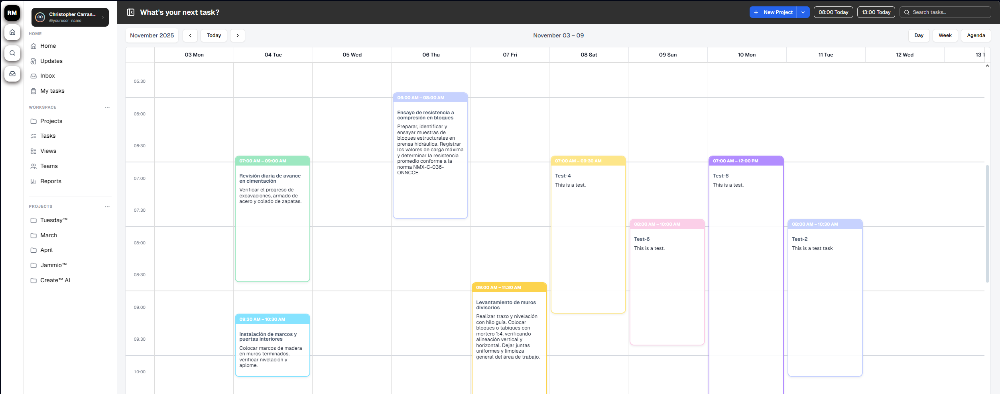
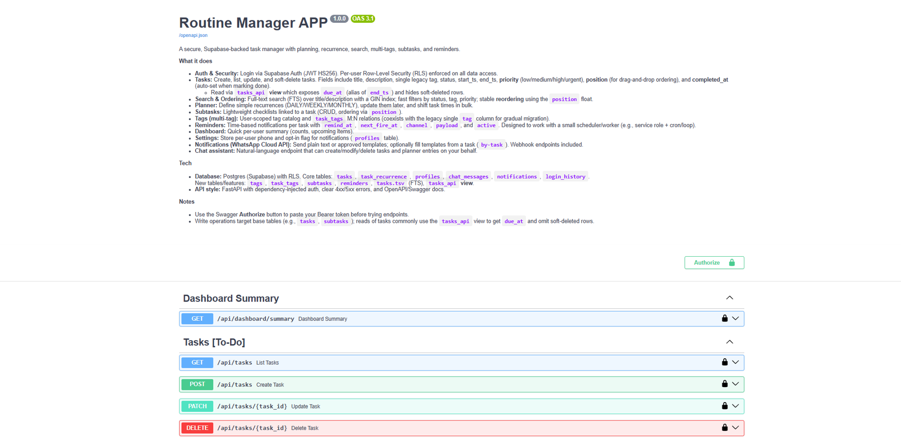
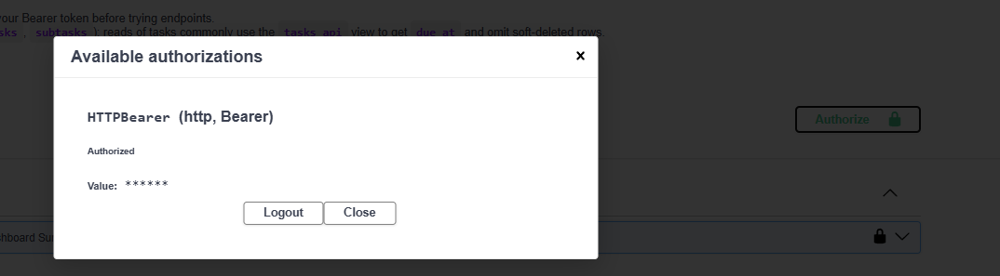
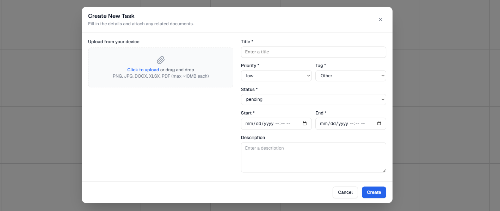
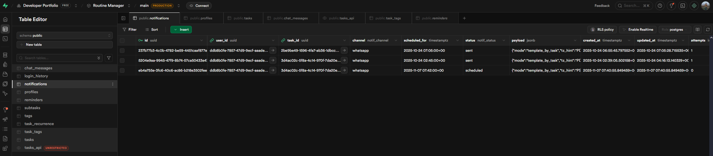

# 📘 Routine Manager

Routine Manager es una aplicación web diseñada para la **gestión
estructurada de tareas y rutinas**, con un **backend en FastAPI**, un
**frontend en Next.js construido mediante V0**, y una infraestructura de
datos apoyada en **Supabase**.\
El sistema permite la creación, actualización, gestión dinámica de
fechas, y notificaciones automatizadas para tareas próximas mediante un
webhook conectado al **WhatsApp Cloud API (Meta)**.



---

## 🚀 Tecnologías Principales


---


## 🗄️ Relación con Supabase

| Función                  | Descripción                                                                 |
|---------------------------|-----------------------------------------------------------------------------|
| 👤 Gestión de Usuarios    | Creación de cuentas, almacenamiento seguro de contraseñas, emisión de tokens |
| 🗂️ Base de Datos          | Registro de historial de inicios de sesión para detección de anomalías, creación, actualización y eliminación de rutinas        |
| ✉️ Correos Automáticos    | Confirmación de registro y restablecimiento de contraseña                     |
| Sincronización de estados | Cambios visuales de la UI reflejan modificaciones en Supabase (fechas / horas)
---

## ⚙️ Tutorial de Configuración y Pruebas

### 1️⃣ Preparación del Entorno
Crea un archivo `.env` en `fastapi-auth-backend/`:

```env
# Credenciales SupabaseSupabase
SUPABASE_URL= "[tu_url_de_supabase]"
SUPABASE_ANON_KEY= "[tu_anonkey_de_supabase]"
SUPABASE_SERVICE_ROLE_KEY= "[tu_clave_de_rol_de_servicio_de_supabase]"
SUPABASE_KEY= "[tu_clave_de_supabase]"

# Authenticated Tests Endpoints
SUPABASE_JWT_SECRET= "[tu_JWT_de_supabase]"
SUPABASE= authenticated
ALLOW_DEV_HEADER= 1

OPENAI_API_KEY= "[tu_clave_de_api_de_openai]"

# WhatsApp Cloud API (Meta)
META_WA_TOKEN= # Permanent Access Token (Graph API)          
META_WA_PHONE_ID= # phone_number_id
META_WA_BUSINESS_ID=  # opcional, útil para diagnósticos
META_WA_VERIFY_TOKEN= # cadena para verificar el webhook

# Dispatcher tunables
DISPATCHER_POLL_SECONDS=30
DISPATCHER_BATCH_SIZE=20
DISPATCHER_MAX_ATTEMPTS=5

# /health/dispatcher"
ADMIN_TOKEN= uno
```

---

### 2️⃣ Limpieza del Historial de Sesiones (Opcional)

> ⚠️ **Nota**: Esto es opcional, pero recomendable para probar la detección de anomalías desde cero.  

1. Ve a tu proyecto de **Supabase** en el navegador.  
2. En el menú lateral, selecciona **SQL Editor**.  
3. Ejecuta la siguiente consulta para encontrar el `user_id` de tu usuario:  

```sql
SELECT id FROM auth.users WHERE email = 'tu_correo@ejemplo.com';
```

4. Copia el `id` resultante.  
5. Elimina el historial de inicio de sesión de ese usuario:  

```sql
DELETE FROM public.login_history WHERE user_id = 'el_id_de_tu_usuario';
```

---

## ▶️ Cómo Ejecutar la Aplicación

> 💡 **Notas Importantes**
> - El backend y el frontend deben iniciarse **por separado**.  
> - Asegúrate de que tu archivo `.env` esté correctamente configurado antes de ejecutar.
> - Instalación previa de UV. DOCS: https://docs.astral.sh/uv/getting-started/installation/#standalone-installer

### 🟢 Backend (FastAPI) con **UV**

### 1. Instalar UV

Windows:

``` powershell
irm https://astral.sh/uv/install.ps1 | iex
```
Linux / macOS:

``` bash
curl -LsSf https://astral.sh/uv/install.sh | sh
```

### 2. Crear entorno e instalar dependencias

``` bash
cd backend/
uv venv
source .venv/bin/activate    # Linux/macOS
.venv\Scripts\activate     # Windows
```

### 3. Ejecutar backend FastAPI

``` bash
uvicorn main:app --reload
```


👉 Disponible en: `http://localhost:8000`

---
# Routine Manager – Backend Overview


## 🔐 Auth & Security

* **Autenticación**: Mediante **Supabase Auth** (JWT HS256).
* **Autorización**: El backend valida cada solicitud usando `auth.uid()`.
* **Seguridad**: Se aplica **Row-Level Security (RLS)** obligatorio sobre todas las tablas del dominio del usuario, garantizando que cada operación (`SELECT`, `INSERT`, `UPDATE`, `DELETE`) afecte **únicamente** a datos pertenecientes al usuario autenticado.


---

## 📅 Tasks

Sistema **CRUD completo** para la gestión de tareas, compatible con metadatos adicionales y el modelo de datos previo.

### Campos Principales
* `title`: Nombre de la tarea.
* `description`: Texto libre.
* `tag`: Columna *legacy* (`ENUM`) mantenida por compatibilidad.
* `status`: `pending` / `in_progress` / `done` / `canceled`.
* `start_ts`: Fecha de inicio.
* `end_ts`: Fecha comprometida de finalización.
* `priority`: `low` / `medium` / `high` / `urgent`.
* `position`: Número flotante para ordenamiento por *drag-and-drop*.
* `completed_at`: Timestamp asignado automáticamente al marcar la tarea como “done”.

### Vista `tasks_api`
Todas las consultas se realizan a través de esta vista, que:
* Expone el campo `due_at` (alias de `end_ts`).
* Oculta tareas *soft-deleted* (si se habilita).
* Proporciona un esquema estable para el cliente.


---

## 🔍 Search & Ordering

* **Búsqueda (FTS)**: Sistema de **Full-Text Search (FTS)** con índice GIN sobre `tasks.tsv`, generado de `title` + `description`. Permite búsqueda por **relevancia**.
* **Filtros**: Capacidades de filtrado eficientes por `status`, `priority` y `tag`.
* **Ordenamiento**:
    * **Estable** mediante el campo `position`.
    * **Reordenamientos rápidos** calculando nuevas posiciones tipo **"floating order"** (e.g., entre items A=1.0 y C=2.0, B=1.5).

---

## 🔁 Planner (Recurrencias)

Planificación recurrente mediante **reglas simples**:

* `DAILY`, `WEEKLY`, `MONTHLY`

### Operaciones
* Crear reglas de recurrencia por tarea.
* Actualizar reglas existentes.
* Aplicar **desplazamientos de tiempo masivos (shift)**.
* Cancelar recurrencias.

La lógica vive en la tabla **`task_recurrence`** con relación 1:1.

---

## ✅ Subtasks

Sistema ligero de *checklists* por tarea.

* **CRUD** completo.
* **Orden independiente** mediante `position`.
* **RLS** heredado por la tarea padre.
* Permite dividir tareas grandes en elementos más simples.

---

## 🏷️ Tags (Multi-tag)

Sistema moderno de etiquetado basado en tablas.

* `tags`: Catálogo de etiquetas por usuario.
* `task_tags`: Relación **M:N** entre tareas y etiquetas.

### Capacidades
* Crear etiquetas.
* Asignarlas / desasignarlas.
* Consultar etiquetas por tarea.
* Consultar tareas por etiqueta.

---

## 🔔 Reminders

Recordatorios temporales asociados a una tarea o independientes.

### Campos Clave
* `remind_at`: Cuándo se debe disparar el recordatorio.
* `next_fire_at`: Siguiente disparo pendiente.
* `channel`: `sms` / `email` / `whatsapp`.
* `payload`: Contenido enriquecido.
* `active`: Estado del recordatorio.

---

## 📊 Dashboard

Resumen rápido optimizado:

* Total de tareas.
* Tareas por estado.
* Próximas tareas.
* Recordatorios próximos.
* Actividad de usuario.

---

## ⚙️ Settings

Ajustes del usuario almacenados en la tabla **`profiles`**.

* `phone`: Número para notificaciones.
* `notify_enabled`: Bandera de *opt-in*.
* Otros metadatos básicos.

---

## 📱 Notifications (WhatsApp Cloud API)

Integración completa con WhatsApp Cloud API.

### Funcionalidad
* Envío de mensajes de texto directo y plantillas aprobadas por Meta.
* Envío de mensajes basados en una tarea (*by-task*).
* **Webhook GET/POST** para verificación y recepción de eventos.

### Helpers de Backend
* Validar entrada de WhatsApp.
* Enviar mensajes programados.
* Registrar logs en la tabla `notifications`.


---

## 🤖 Chat Assistant

*Endpoint* de lenguaje natural que:

1.  Recibe texto libre.
2.  Interpreta **intención**.
3.  Crea/modifica/borra tareas.
4.  Administra *planner*/recurrencias.
5.  Mantiene historial en `chat_messages`.

El backend se integra con tu LLM via `assistant_llm.py`.

---

## 💻 Tech Stack

### Database (Supabase / Postgres + RLS)

* **Tablas Base**: `tasks`, `task_recurrence`, `profiles`, `chat_messages`, `notifications`, `login_history`.
* **Nuevas Tablas Funcionales**: `tags`, `task_tags`, `subtasks`, `reminders`.
* **Índice FTS**: `tasks.tsv`.
* **Vista Pública**: `tasks_api`.
* **RLS**: **Obligatorio** en todos los objetos y configurado correctamente.

### API (FastAPI)

* Backend construido con **FastAPI**.
* Dependencias de autenticación para validación del JWT.
* *Routers* modulares.
* Errores `4xx`/`5xx` claros.
* **OpenAPI/Swagger** completamente documentado.
* Operaciones **idempotentes** y validación fuerte mediante **Pydantic v2**.

---

### ⚫ Iniciar el Frontend (Next.js)

```bash
cd fastapi-auth-frontend/
npm install
npm run dev
```

👉 Disponible en: `http://localhost:3000`

---

## 📬 Contacto
Si tienes dudas o sugerencias, ¡puedes abrir un issue o contribuir con un PR! 🚀
"# Routine-Manager" 
